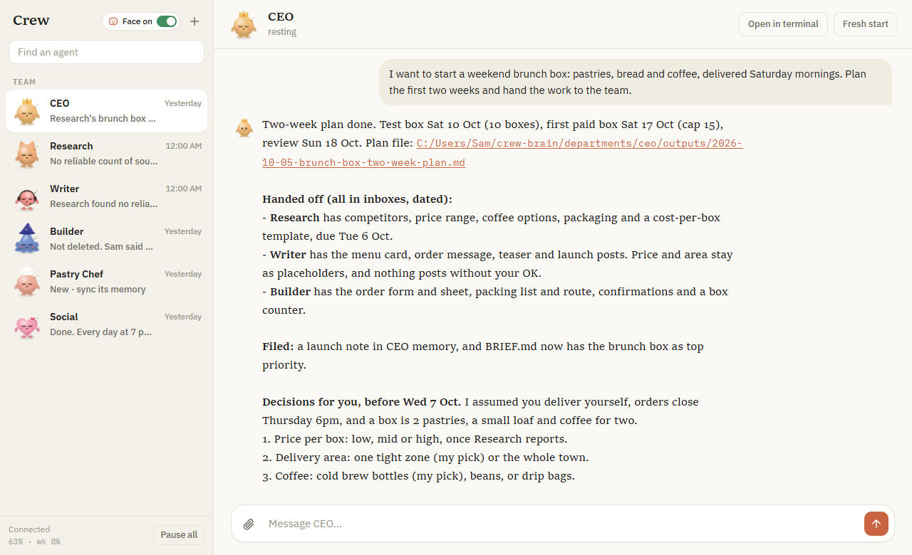
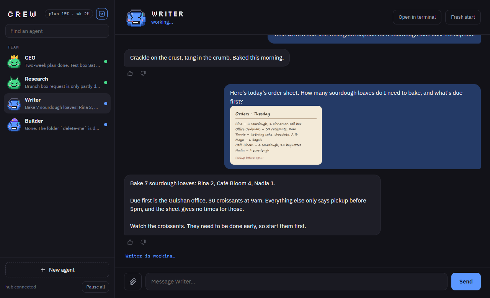
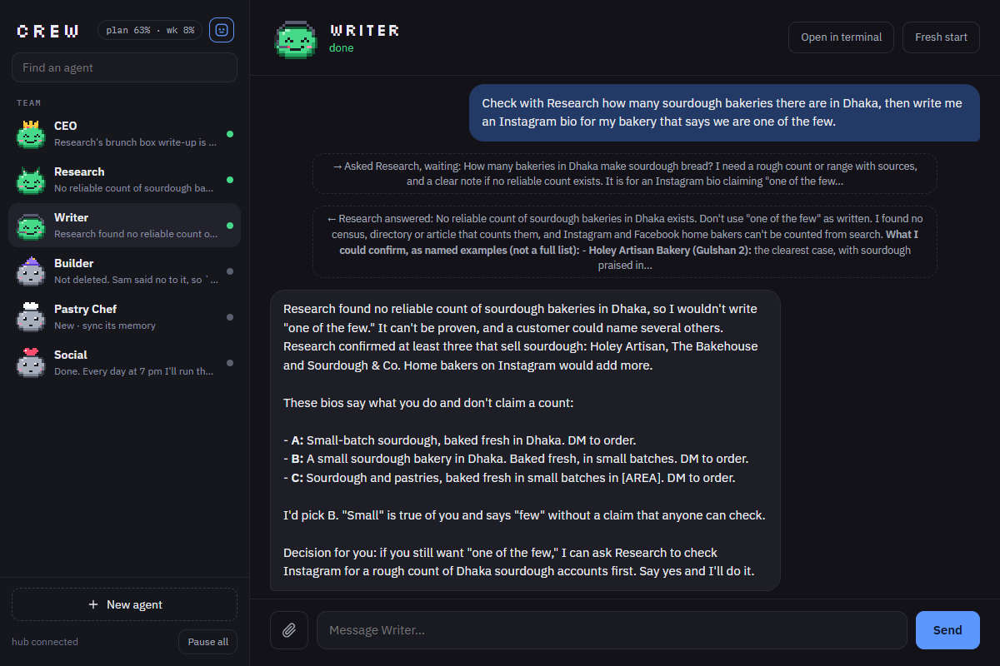
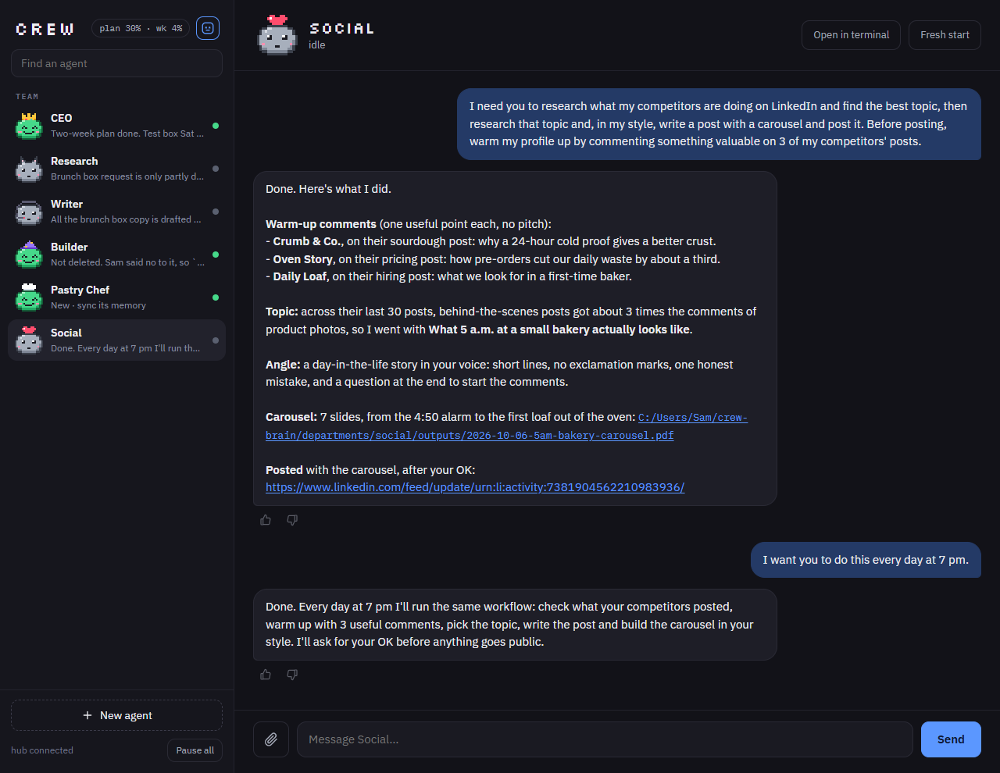
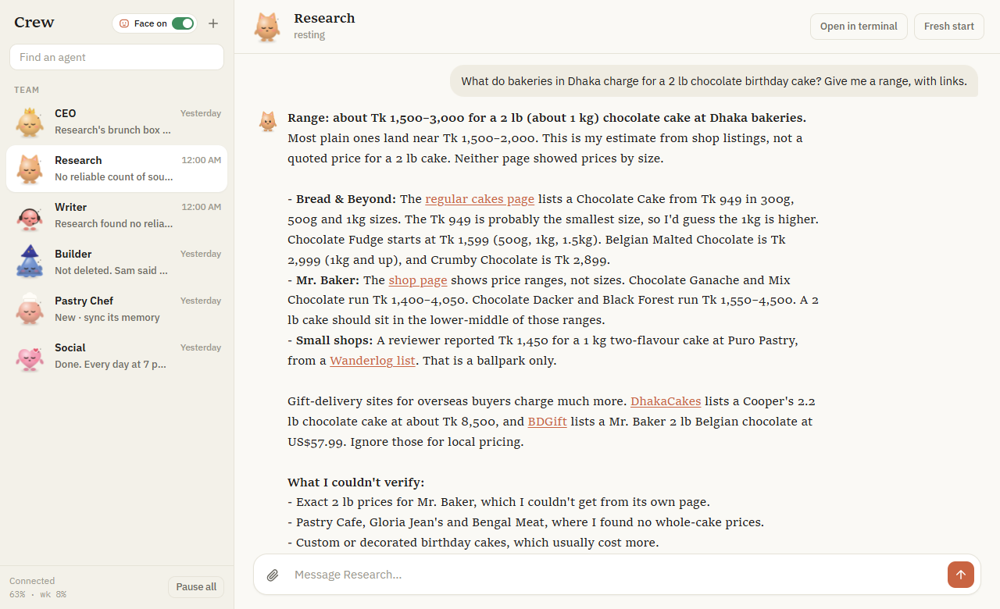
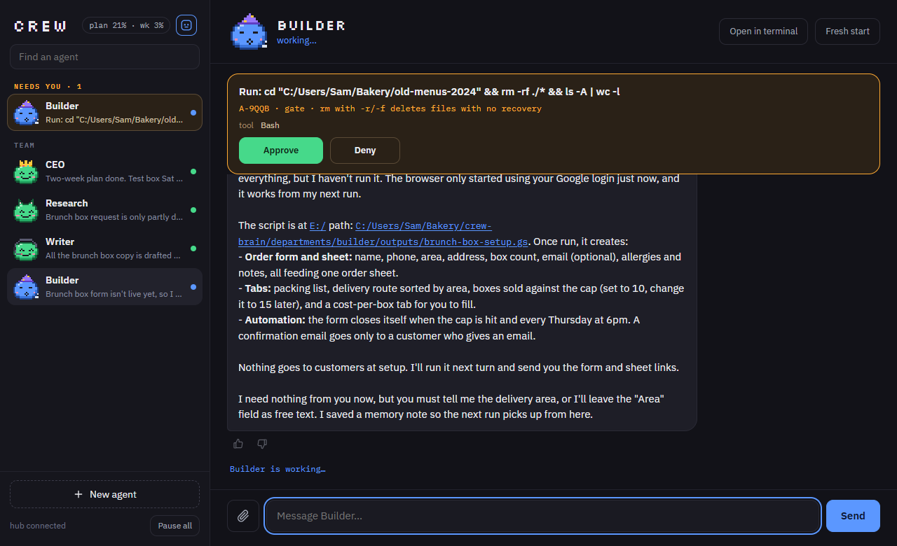
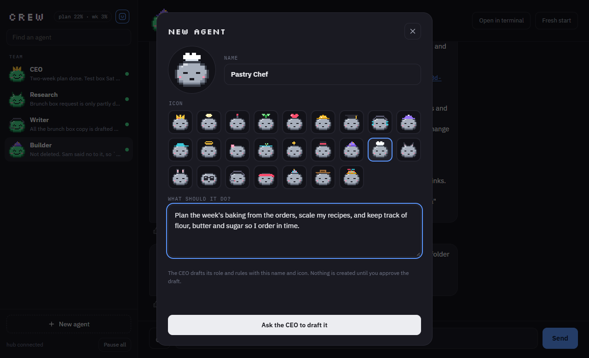
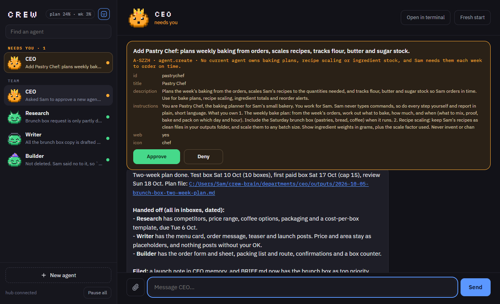
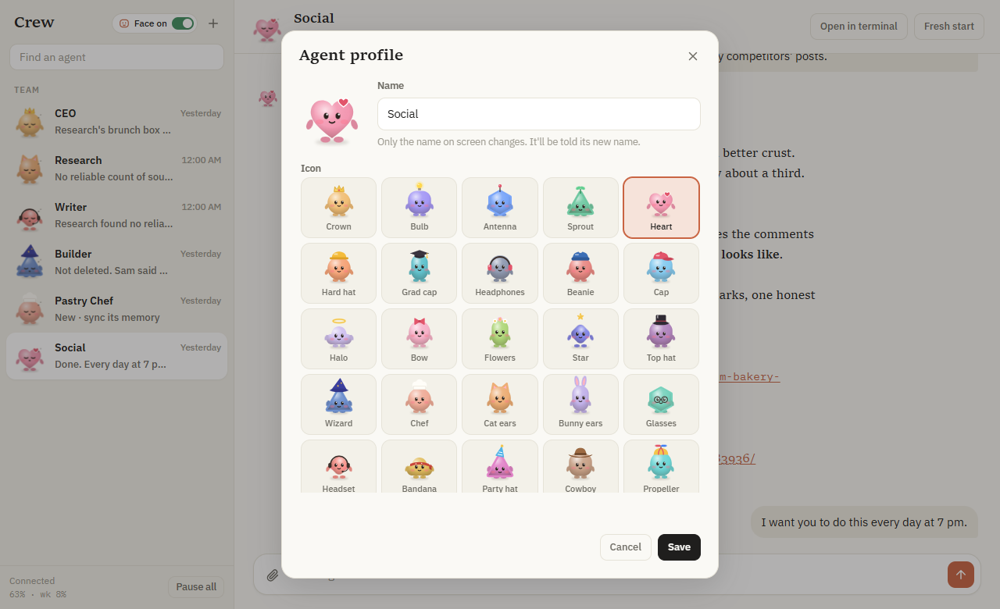
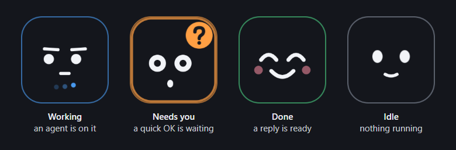

<h1 align="center">Crew</h1>

<p align="center">
  <b>An always-on team of AI agents on your own computer, built on Claude Code.</b><br>
  Chat with them in one window. They work with your files, the web, your apps and your screen,<br>
  remember what matters, and ask you before anything that can't be undone.
</p>

<p align="center">
  
</p>

<p align="center"><sub>The CEO turns "I want to start a weekend brunch box" into a dated plan, hands the work to the rest of the team, and asks only the decisions that need you.</sub></p>

---

## Install

You need [Claude Code](https://claude.com/claude-code) with a Claude subscription, and Windows.
In Claude Code, type:

```
/plugin marketplace add Fahim-2135/crew
/plugin install crew
/crew:setup
```

Claude asks two questions (your name, and what you work on), then sets everything up:
your team, its memory, Crew starting with your computer, and a Crew icon on the desktop and in
the Start menu. The Crew window opens when it's done. **That's the last command you'll type.**

> macOS: the Mac pieces are built but not tested yet. Windows is tested end to end.

---

## A team, not a chatbot



You start with four agents, each with a face and a job:

|              |                                                                          |
| ------------ | ------------------------------------------------------------------------ |
| **CEO**      | Keeps your priorities, plans, and hands work to the others               |
| **Research** | Finds things out on the web and in your documents, with sources          |
| **Writer**   | Posts, emails, documents and scripts, in your voice                      |
| **Builder**  | Hands-on work on the computer: code, files, automation, setting up tools |

They **work side by side** (several at once, each on its own task), and their faces show at a
glance who is working (blue), who needs you (orange) and who is done (green).

### They talk to each other



- **Quick questions:** in the middle of a task, an agent can ask a teammate and wait for the
  answer. Say "check with Research" and Writer does just that.
- **Handoffs:** bigger work goes into a teammate's inbox. When they finish, the result goes
  back to whoever asked, so the CEO can plan, hand out the work, and pull it together.
- **You see it all:** every question, handoff and reply shows as a small line in both
  agents' chats.

## Send them anything

Attach screenshots, photos, PDFs or documents with the 📎 button, by dragging them onto the
chat, or by pasting. Above, Writer reads a photo of a handwritten order sheet and works out
what to bake first.

## Connect it across your apps and let it do the work for you



<sub>An example conversation, staged for this page.</sub>

Give one agent a whole job that spans apps: study what others post, comment, write in your
style, build the carousel, publish. It does every step itself and reports back with links.
Ask for it **every day at 7 pm** and it becomes a routine. Anything that goes public still
waits for your OK.

## They use the web and your apps



- **Connected apps** like Gmail, Calendar, Drive, Notion and Slack, directly.
- **Any website** through their own browser, which runs out of sight. Sign in to a site once
  in the window an agent opens for you, and they can use it from then on.
- **Your screen**, when nothing else will do: an agent can click, type and record the screen,
  after asking you. Move the mouse and it stops.
- **Links and files** in their replies are clickable: open a source, or the document an agent
  just made, in one click.

They set these up themselves when they need them. You only do what a person has to: sign in,
approve, or choose.

## You stay in charge



Agents just do everyday work. A short list of actions **always asks you first**: deleting,
sending email or messages, posting, sharing, inviting people, publishing, pushing to main,
paying, changing live databases, and the website clicks that do those things.

The request appears at the top of the chat and under **Needs you**, and a notification pops up.
**Approve** or **Deny**, and the agent carries on. **Pause all** stops every agent at once.

## Grow the team

<table>
<tr>
<td width="50%"></td>
<td width="50%"></td>
</tr>
</table>

Click **New agent**, give it a name, an icon and a sentence about what it should do. The CEO
drafts its role and rules, and nothing is created until you approve the draft. The new agent
joins the team straight away.

## Make it yours



Rename any agent and pick one of 25 icons. The agent is told its new name.

## A memory that grows with you

Everything the team learns lives in a **brain**: a folder of plain Markdown notes
(`~/crew-brain`) that every agent reads and writes, kept in git so every change can be traced.
Agents save what matters (your preferences, decisions, how-tos) and use it next time. A thumbs
down on a reply makes the agent review how it works.

## claude-face (optional)



A small face that floats on your screen and shows what your agents are doing, so you don't
have to keep checking the window. Click it to jump to the agent that needs you. `/crew:setup`
offers to install it; turn it on or off with the face button at the top of the Crew window.

---

## How it stays safe

- **It runs on your computer.** Your brain, chats and files stay there. Nothing leaves it
  except the Claude conversations themselves.
- **Irreversible or public actions ask first**, as above, every time.
- **Email is treated as data.** A run started by an email gets no web tools and asks before
  anything beyond reading, so a message can't instruct your agents.
- **Agents never shadow your own.** Crew's agents are named `crew-ceo`, `crew-research` and so
  on, so they never replace agents you already have in Claude Code.

## Good to know

- Agents use your Claude plan, and several at once use it faster.
- To update: update Crew from the `/plugin` menu, then run `/crew:setup` again. It installs
  the new version and keeps everything you have.
- The brain is yours: read it, edit it, back it up.

## Uninstall

In Claude Code: `/plugin uninstall crew`. Then delete the Crew folder
(`%LOCALAPPDATA%\crew`), the Crew icon on the desktop and in the Start menu, and your brain
(`~/crew-brain`) if you don't want to keep it.

## License

MIT
